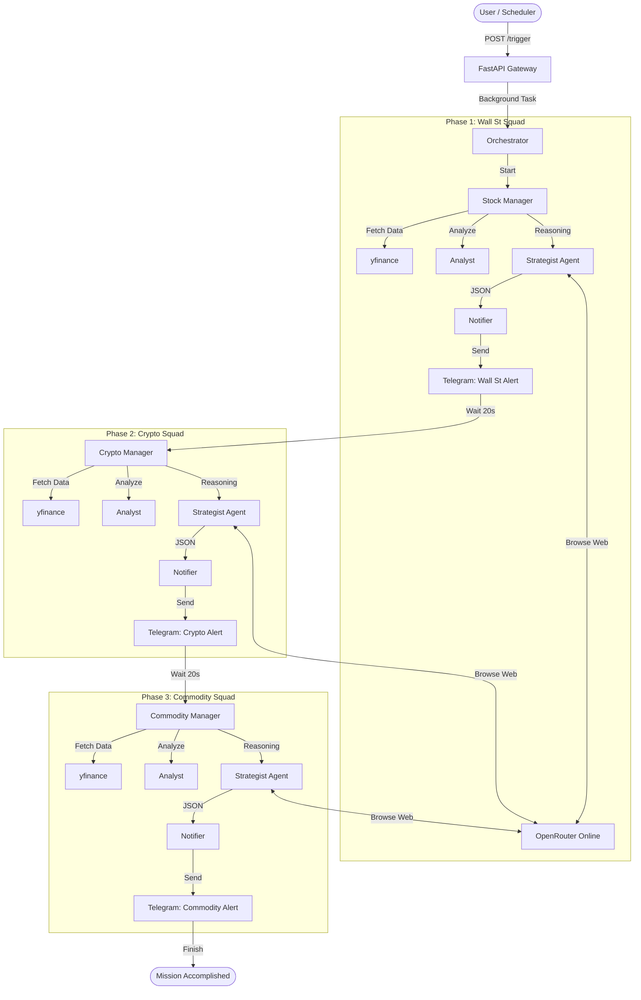

# AlphaSwarm: System Architecture Flowchart 🦅

Berikut adalah desain flowchart detail untuk **NanoBanana 3D**.
Alur ini mencakup **End-to-End Flow**: Dari Input (API) -> Proses AI (3 Squads) -> Output (Telegram) -> Deployment (Docker).

---

## 🔹 SECTION 1: THE TRIGGER (START)

**[User / Cron Job]** 
   ⬇️ *HTTP POST /trigger*
**[FastAPI Gateway]** 
   *(Port 8080 | app.py)*
   ⬇️ *Spawns Background Task*
**[Orchestrator Core]** 
   *(run_alpha_swarm.py)*

---

## 🔹 SECTION 2: PHASE 1 - WALL STREET SQUAD (STOCKS)

**[Orchestrator Core]**
   ⬇️ *Activates Phase 1*
**[Stock Manager]**
   ⬇️ *Fetches S&P 500 Data (yfinance)*
**[Filter Logic]**
   *(Select Top 20 based on Volume)*
   ⬇️ *Pass to Technical Analyst*
**[Stock Analyst]**
   *(Calculates RSI, MACD, MA)*
   ⬇️ *Select Top 5 Candidates*
**[Stock Strategist AI]**
   *(Loop for each Stock)*
   ┃
   ┣━━ ➡️ **[OpenRouter Search]** 🌐 *(Search: "News for [Ticker]" + "Earnings")*
   ┣━━ ⬅️ **[Web Content]**
   ┃
   ⬇️ *Reasoning (DeepSeek R1)*
**[JSON Strategy Output]**
   *(Signal, Headline, News Summary)*
   ⬇️
**[Notifier Agent]**
   ⬇️ *Formats HTML Message*
**[Telegram API]** ✈️ 
   *(Sent: "🦅 Wall Street Alert")*

---

## 🔹 SECTION 3: THE COOLDOWN (ANTI-SPAM)

**[Orchestrator Core]**
   ⬇️ *Waits 20 Seconds* ⏳
   *(Prevents Telegram Rate Limit)*

---

## 🔹 SECTION 4: PHASE 2 - CRYPTO SQUAD

**[Orchestrator Core]**
   ⬇️ *Activates Phase 2*
**[Crypto Manager]**
   ⬇️ *Fetches Top 50 Coins (yfinance)*
**[Filter Logic]**
   *(Force Include: BTC, ETH + Top 3 Volatile)*
   ⬇️
**[Crypto Analyst]**
   *(Calculates Bollinger Bands, Drawdown)*
   ⬇️
**[Crypto Strategist AI]**
   *(Loop for each Coin)*
   ┃
   ┣━━ ➡️ **[OpenRouter Search]** 🌐 *(Search: "Crypto Sentiment", "SEC News")*
   ┣━━ ⬅️ **[Web Content]**
   ┃
   ⬇️ *Reasoning (DeepSeek R1)*
**[JSON Strategy Output]**
   ⬇️
**[Notifier Agent]**
   ⬇️ *Formats HTML Message*
**[Telegram API]** ✈️ 
   *(Sent: "🪙 Crypto Market Intel")*

---

## 🔹 SECTION 5: THE COOLDOWN (ANTI-SPAM)

**[Orchestrator Core]**
   ⬇️ *Waits 20 Seconds* ⏳

---

## 🔹 SECTION 6: PHASE 3 - COMMODITY SQUAD

**[Orchestrator Core]**
   ⬇️ *Activates Phase 3*
**[Commodity Manager]**
   ⬇️ *Target Assets: Gold (XAU), Silver (XAG), Oil (WTI)*
**[Commodity Analyst]**
   *(Calculates Support/Res, Volatility)*
   ⬇️
**[Commodity Strategist AI]**
   ┃
   ┣━━ ➡️ **[OpenRouter Search]** 🌐 *(Search: "Geopolitics", "War", "Inflation")*
   ┣━━ ⬅️ **[Web Content]**
   ┃
   ⬇️ *Reasoning (Macro Perspective)*
**[Notifier Agent]**
   ⬇️ *Formats HTML Message*
**[Telegram API]** ✈️ 
   *(Sent: "🛢️ Commodity/Macro Intel")*

---

## 🔹 SECTION 7: DEPLOYMENT ARCHITECTURE

**[Codebase]**
   *(Python 3.10 + .env)*
   ⬇️ *docker build -t alphaswarm .*
**[Docker Image]**
   *(Lightweight Python Slim)*
   ⬇️ *docker run / Cloud Run*
**[Container Instance]** 🐳
   *(Running Uvicorn Server :8080)*

---

## 🧩 Mermaid Diagram (Technical View)

